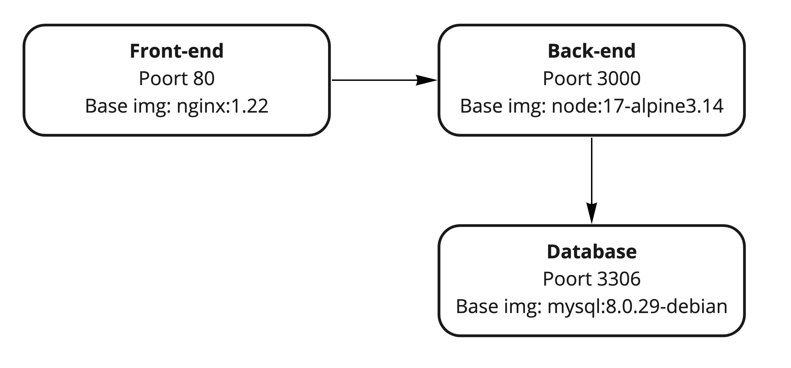

# BaseApp

Welkom bij het de repository voor de doorlopende opdracht van DevOps. 

## Situatie

Je werkt voor ACME. Ze hebben onlangs een todo-applicatie ontwikkeld. 
Je wordt gevraagd om een DevOps pipeline uit te werken. Hiervoor zal je op een remote Linux machine werken.

Er zijn twee onderdelen: Back-end en Front-end. Er is geen authenticatie.

De back-end is een NodeJs applicatie die de API host. De back-end luistert op poort 3000. 
De back-end draait standaard in-memory. Met andere woorden, de taken worden enkel opgeslagen in geheugen, niet op disk. 
De back-end kan ook een connectie maken naar een mysql databank. Die stel je in met volgende environment variabelen:

* STORAGE=mysql
* MYSQL_HOST=<hostname>
* MYSQL_USER=<username>
* MYSQL_PWD=$mysqlpwd 
* MYSQL_DB=$mysqldb

De Front-end is een HTML5 statische applicatie en luistert op poort 80. 
Via AJAX calls wordt de API aangeroepen. De front-end en de API moeten op dezelfde host draaien. 
De API draait in een subfolder /api.

## Architectuur

Indien je een foutmelding krijgt bij het binnenhalen van de docker images van docker hub, gebruik dan volgende locaties:
* Node: public.ecr.aws/i9i5l3g4/node:17-alpine3.14
* Nginx: public.ecr.aws/i9i5l3g4/nginx:1.22
* Mysql: public.ecr.aws/i9i5l3g4/mysql:8.0.29-debian

## Opdracht:

1. Connecteer naar je Debian Linux omgeving
1. Clone deze repository
1. Bouw een container voor de back-end. De back-end draait op NodeJS. Je maakt gebruik van de node:17-alpine3.14 base image.
1. Bouw een container voor de front-end. De front-end draait op Nginx. Je maakt gebruik van de nginx:1.22 base image. De configuratie voor nginx vind je in de code repository.
1. Maak een docker compose file aan die deze containers refereert. Expose je front-end op poort 80.
1. Voer docker compose uit en kijk of je de website kan opstarten.
1. Voeg Mysql toe aan je netwerk dmv een docker container. Je maakt gebruik van de mysql:8.0.29-debian base image. Voeg disk mappings toe zodat de state van je mysql container bewaard blijft.
1. De repository bevat een bestand init.sql. Zorg dat dit wordt uitgevoerd bij de start van de Mysql container. 
1. Configureer de API zodat die deze MySql databank gebruikt.
